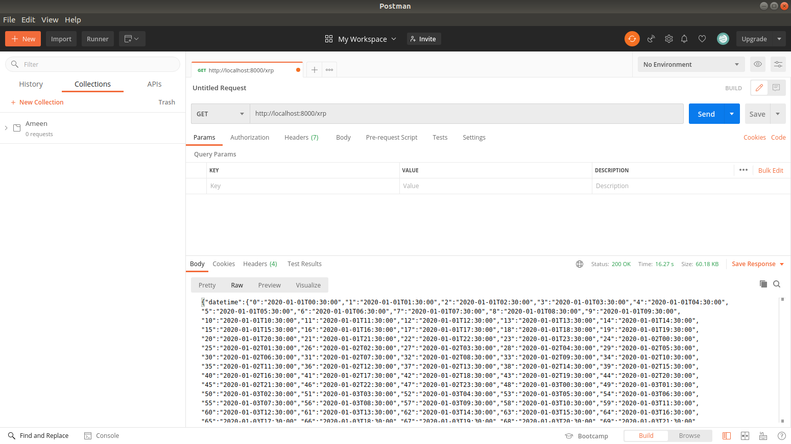
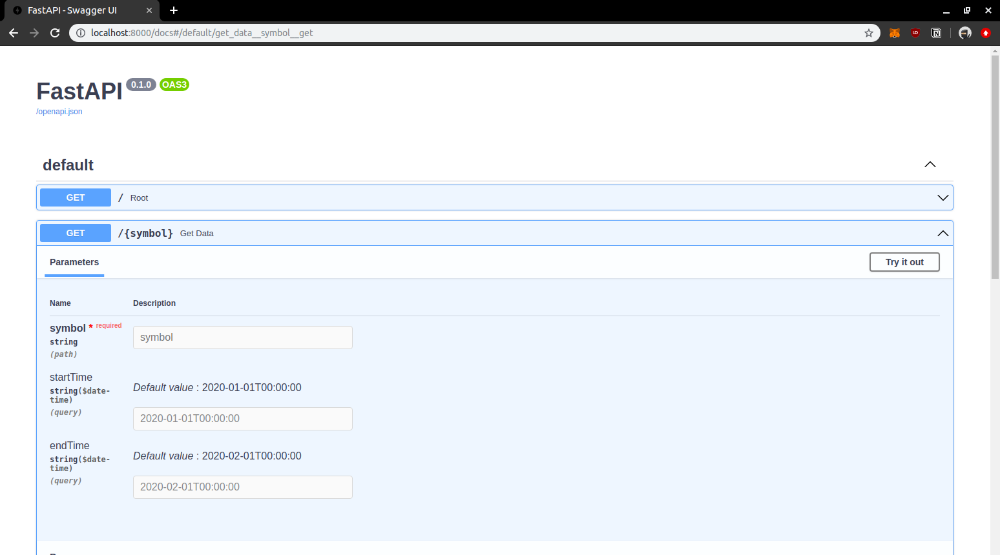
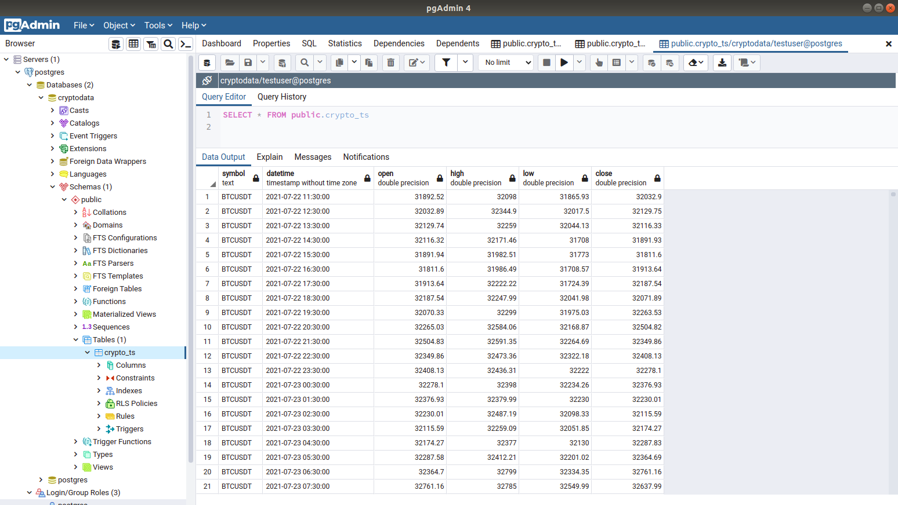
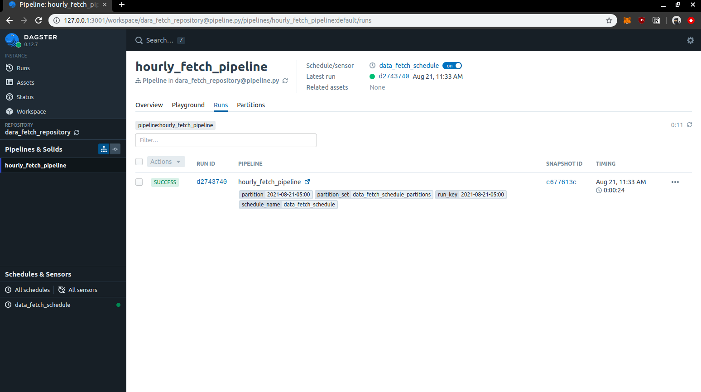
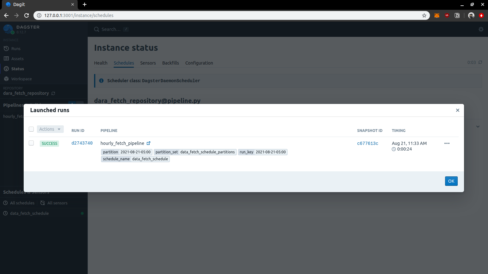

# The content in this repository is based on work performed here:
https://github.com/ameenpv/dagster-etl.git

## FastAPI + Dagster Data Orchestration

### 1 : API that returns historical hourly Crypto OHLC Data

    conda create --name technical-test python=3.10

Activate the conda virtual env:

    conda activate technical-test
Install the required libraries with requirements.txt

    pip install -r requirements.txt

To initiate the FastAPI:

    uvicorn main:app --reload

Link for checking whether API is up: [localhost:8000](localhost:8000)
Docs from Swagger UI will be available at: [localhost:8000/docs](localhost:8000/docs) 
To get data of BTCUSDT symbol - Go to [localhost:8000/btc](localhost:8000/btc)

#### Docker:
I've added a Dockerfile for the first task (Note: this is only usable for first task):

     sudo docker build -t api .

     sudo docker run --name api -p 8000:8000 api

#### Screenshots:
 

 

### 2 : Postgres table with 1 month of data for equity (*backfill.py*)

setup a PostgreSQL Database with preferred username and password:

    sudo -u postgres psql -c 'create database cryptodata;'
    sudo -u postgres bash -c "psql -c \"CREATE USER testuser WITH PASSWORD 'testpass'; GRANT ALL PRIVILEGES ON DATABASE cryptodata TO testuser;\""    

Then run the script from terminal by:

    python backfill.py
Screenshot of DB after running the script:
 

### 3: Hourly Pipeline in Dagster to schedule and fetch hourly OHLC Crypto data for BTC, ETH, and XRP
The file pipeline.py contains the whole process of schedule and data fetch. Since Dagster offers Schedules, I'll be using hourly_schedule() to fetch price data on an hourly basis. I'll be giving execution time as 0 minute of every hour.

##### Initiate Dagster Ui using dagit:

    dagit -f pipeline.py
   Dagster UI will be up at: [localhost:3000](http://localhost:3000)

##### Run Dagster-Daemon for Schedules:
First please declare the home directory for dagster:

    export DAGSTER_HOME="~{path-to-the-project+temporary-folder-created-by-dagster}"
 
**path-to-the-directory + *temporary-folder-created-by-dagster***:
Since this is just a temporary instance, the Dagster will assign a temporary storage directory for schedules and pipelines. please consider declaring it with the above command.
Then run the Daemon with:

    dagster-daemon run
Now the instance will be running and the schedules will be shown in "All Schedules".
Here are some screenshots after the scheduled runs:
 

 

 

The database is updated without any interruption with new timestamps!

Thank you for reading.
